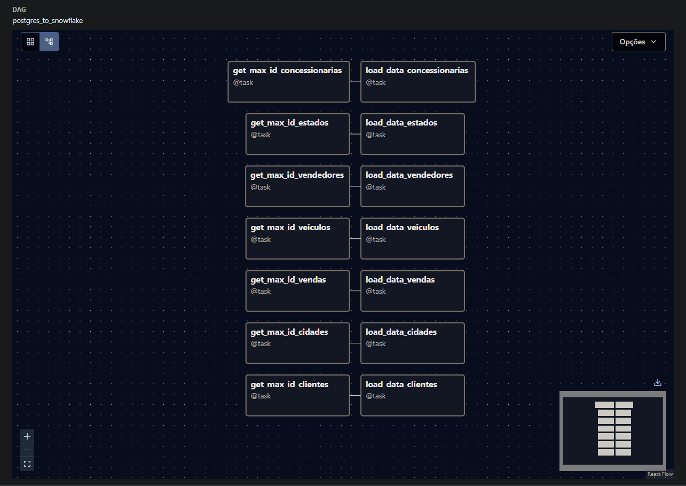
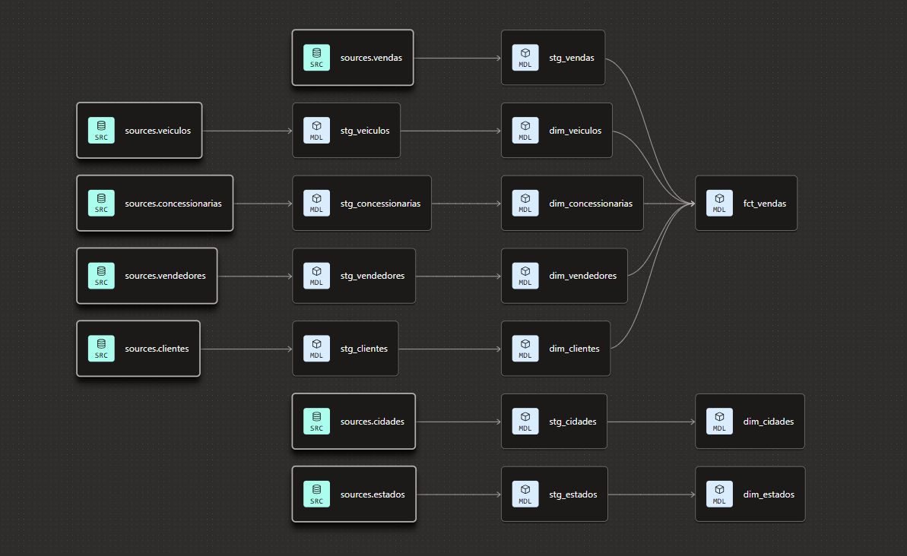
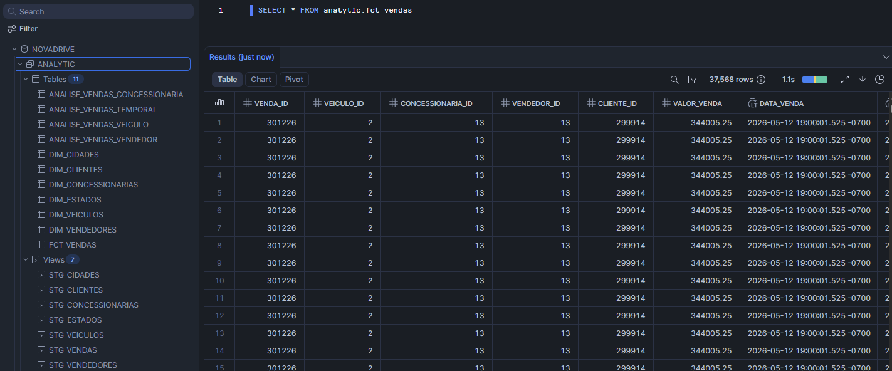
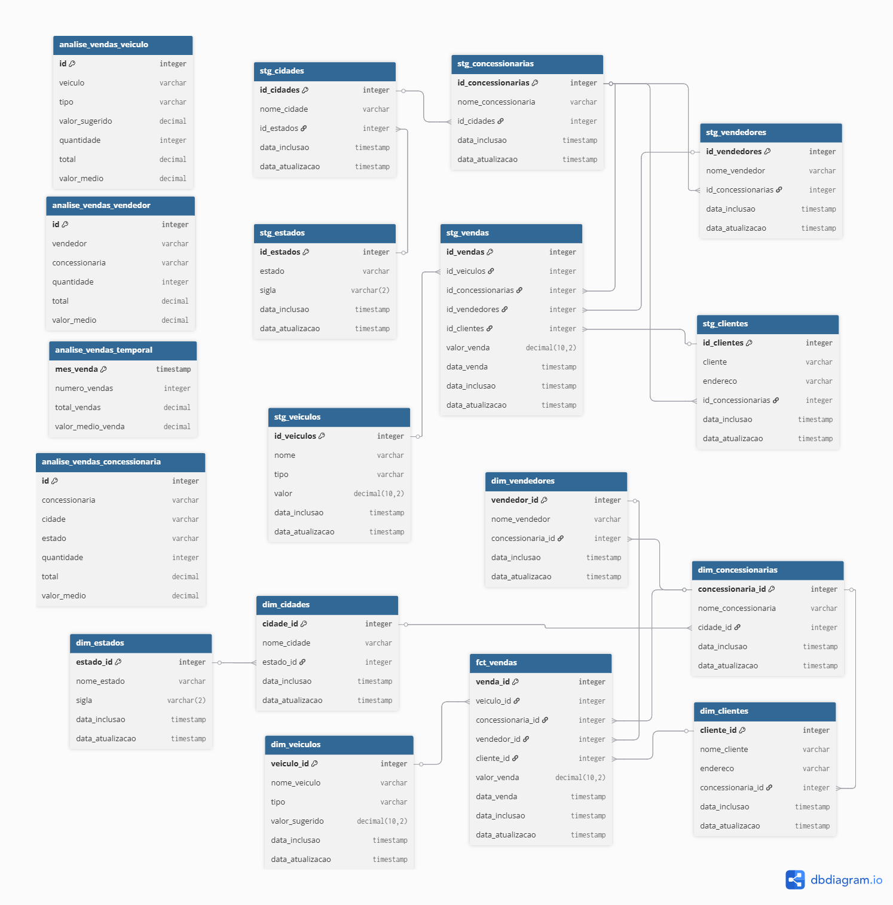
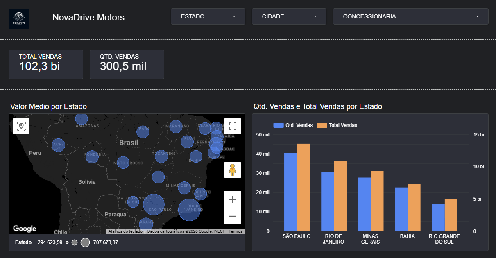

# Automotive Data Platform

Projeto de Engenharia de Dados desenvolvido para simular o ambiente analítico de uma empresa do setor automotivo utilizando conceitos da Modern Data Stack.

O objetivo deste projeto é demonstrar conhecimentos práticos em:

* Engenharia de Dados
* ETL/ELT
* Orquestração de Pipelines
* Data Warehousing
* Analytics Engineering
* Infraestrutura em Cloud
* Modelagem Dimensional
* Business Intelligence

---

# 📌 Visão Geral do Projeto

O projeto simula toda a arquitetura analítica de uma empresa de vendas de veículos.

Os dados transacionais são extraídos de um banco PostgreSQL, orquestrados com Apache Airflow, carregados no Snowflake, transformados com dbt e posteriormente consumidos em dashboards no Google Data Studio.

---

# 🏗️ Arquitetura da Solução

```text id="6oz2m5"
PostgreSQL (OLTP)
        ↓
Apache Airflow
(Orquestração & ELT)
        ↓
Snowflake
(Data Warehouse)
        ↓
dbt
(Transformações)
        ↓
Camada Analítica
        ↓
Data Studio
(Dashboards & Insights)
```

---

# ⚙️ Tecnologias Utilizadas

| Tecnologia     | Objetivo                    |
| -------------- | --------------------------- |
| PostgreSQL     | Banco de dados transacional |
| Apache Airflow | Orquestração de pipelines   |
| Docker         | Conteinerização             |
| AWS EC2        | Infraestrutura cloud        |
| Snowflake      | Data Warehouse              |
| dbt            | Transformação de dados      |
| Data Studio    | Visualização de dados       |
| GitHub         | Versionamento de código     |

---

# 📂 Estrutura do Repositório

```text id="u7zw7d"
automotive-data-platform/
│
├── airflow/
│   └── dags/
│
├── dbt/
│   ├── models/
│   ├── macros/
│   ├── snapshots/
│   ├── tests/
│   ├── dbt_project.yml
│   └── dbt_tests.yml
│
├── sql/
│   └── snowflake/
│
├── docs/
│
├── .env.example
├── docker-compose.yaml
├── README.md
└── .gitignore
```

---

# 🔄 Pipeline de Dados

## 1. Extração dos Dados

O sistema de origem é um banco PostgreSQL contendo informações sobre:

* Clientes
* Funcionários
* Concessionárias
* Veículos
* Vendas
* Localizações

O Apache Airflow é responsável pela orquestração e agendamento das execuções.

---

## 2. Carga dos Dados

Os dados extraídos são carregados no Snowflake, inicialmente armazenados na camada raw/stage.

Essa camada preserva os dados próximos da estrutura original do sistema transacional.

---

## 3. Transformação dos Dados

As transformações são realizadas utilizando dbt, seguindo uma arquitetura em camadas.

### Camada Staging (`stg_`)

Responsável por:

* Padronização
* Limpeza
* Renomeação de colunas
* Tratamento inicial

### Camada Dimensional (`dim_`)

Responsável por:

* Entidades de negócio
* Modelagem dimensional
* Criação de chaves substitutas

### Camada Fato (`fct_`)

Responsável por:

* Consolidação das métricas
* Indicadores de negócio
* Centralização das vendas

### Camada Analítica (`analise_`)

Responsável por:

* Datasets finais para BI
* Visões analíticas
* Otimização para dashboards

---

# 📊 Analytics & Dashboards

A camada analítica é consumida por dashboards desenvolvidos no Google Data Studio, disponibilizando análises como:

* Performance de vendas
* Comparativo de vendas entre concessionárias
* Comparativo de vendas entre cidades/estados

---

# 🧱 Modelagem de Dados

O projeto utiliza modelagem dimensional seguindo o conceito de Snowflake Schema.

## Tabela Fato

* `fct_vendas`

## Tabelas Dimensão

* `dim_clientes`
* `dim_vendedores`
* `dim_estados`
* `dim_cidades`
* `dim_veiculos`
* `dim_concessionarias`

---

# ☁️ Infraestrutura

A infraestrutura do projeto está hospedada em uma instância AWS EC2 utilizando containers Docker.

Principais serviços executados:

* Apache Airflow
* Serviços de scheduler

Esse ambiente busca simular uma arquitetura moderna utilizada em projetos reais de Engenharia de Dados.

---

# 🐳 Conteinerização

Docker foi utilizado para padronizar e isolar o ambiente da aplicação.

Benefícios:

* Reprodutibilidade do ambiente
* Facilidade de deploy
* Padronização da infraestrutura
* Escalabilidade

---

# 📁 Estrutura no Snowflake

O ambiente no Snowflake foi organizado em múltiplas camadas:

```text id="jlwm1s"
RAW/STAGE
↓
STAGING
↓
DIMENSIONS
↓
FACTS
↓
ANALYTICS
```

Os scripts SQL utilizados para criação das estruturas estão disponíveis neste repositório.

---

# 🧪 Qualidade dos Dados

Foram implementados testes utilizando dbt para garantir qualidade e confiabilidade dos dados, incluindo:

* Testes de unicidade
* Testes de valores nulos
* Testes de relacionamento
* Validações de integridade

---

# 📈 Conceitos Aplicados

Este projeto aplica diversos conceitos modernos de Engenharia de Dados:

* Pipelines ELT
* Orquestração de workflows
* Cloud Data Warehouse
* Analytics Engineering
* Modelagem Dimensional
* Arquitetura em camadas
* Conteinerização
* Qualidade de dados

---


# 📸 Capturas do Projeto

## Apache Airflow



## dbt Lineage



## Snowflake




## Dashboards Data Studio



---

# 🎯 Objetivo do Projeto

O principal objetivo deste projeto é demonstrar experiência prática na construção de uma plataforma moderna de dados utilizando ferramentas amplamente utilizadas pelo mercado.

O projeto busca evidenciar competências relevantes para posições como:

* Engenheiro de Dados
* Analytics Engineer
* BI Engineer
* Cloud Data Engineer

```
```
